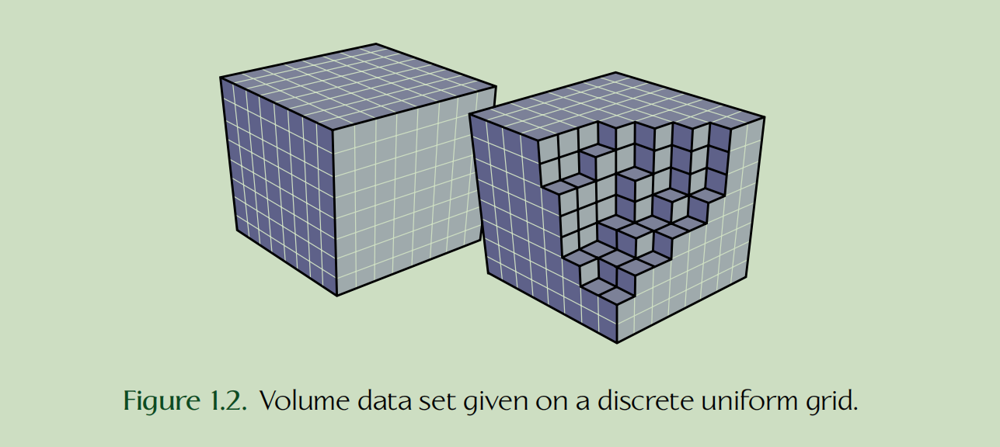
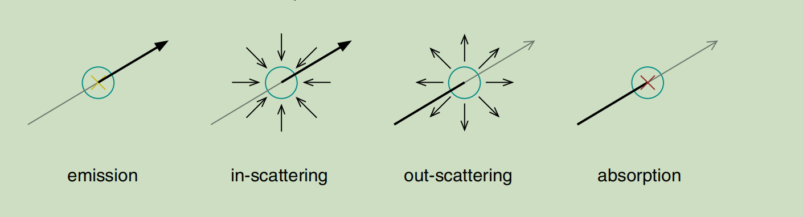

- 体渲染的目标：模拟光传播过程，生成虚拟摄像机记录的图像

## 两种体渲染方式：direct Volume visualization和photorealistic volume rendering

### 1. direct volume visualization
直接体数据可视化的目标是将3D scalar field映射为物理量，用这些物理量表示光的交互结果
$$
\Phi: R^3 \rightarrow R
$$

这些3D scalar field通常是从仿真或者是测量中得到的数据，定义为一些离散的3D网格，例如CT扫描的数据

### 2. 光的传输

光和物体交互过程中会形成三种基本现象，
- emission: 光进入物体后又从物体中出来，例如和气体进行交互时
- absorption：光进入物体后没有从物体中出来，而是在和物体交互时被吸收
- scattering：光进入物体或打在物体表面时出现了反弹，从而形成了散射，例如光的漫反射和镜面反射效果等